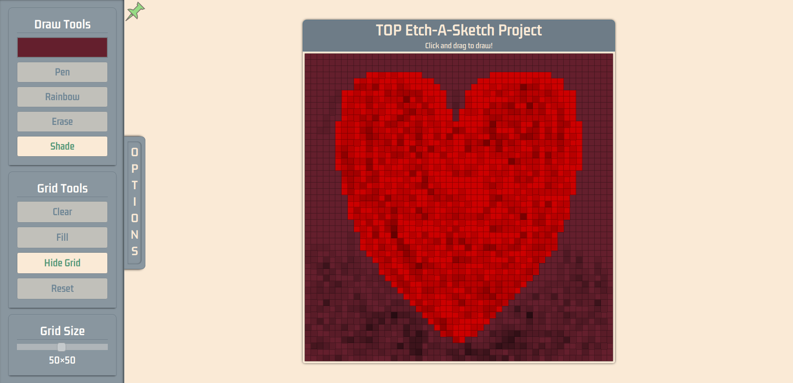

# TOPEAS

<b>The Odin Project Fundamentals Etch-A-Sketch Project Sketch your own pixel art sized up to 96px x 96px</b>

<b><a href="https://trello.com/b/Rgb7qgg7/topeas">Public Trello Board</a></b>

<b>QuickStart >></b>

1. Select your pixel density at the bottom of the drawing platform
2. Select any color of your choice to draw with
3. Select the mode in which you wish to draw
4. Choose any desired toggleables
5. Make some gorgeous pixel art!

<b>Drawing Modes >></b>

- <b>Draw</b>: Fill per-pixel with the selected color
- <b>Rainbow</b>: Fill per-pixel with a randomly generated color
- <b>Erase</b>: Remove the color of the pixel, per-pixel
- <b>Shade</b>: Reduce the pixel's brightness by 10% each pass

<b>Grid Actions >></b>

- <b>Clear</b>: Remove the color from all pixels.
- <b>Fill</b>: Fill all uncolored pixels with the selected color
- <b>Grid</b>: Show / Hide the pixel outlines
- <b>Reset</b>: Reset the grid to it's default state of 16x16 uncolored pixels with no grid
